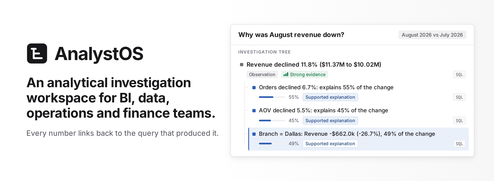
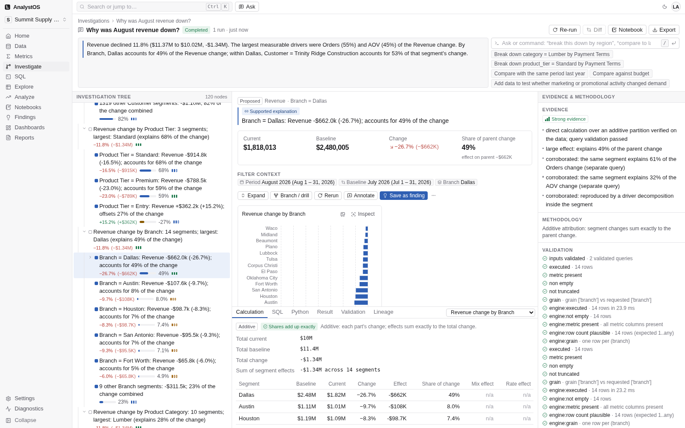
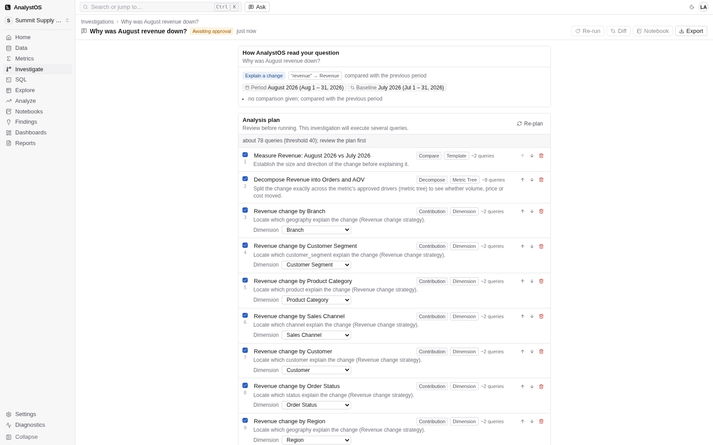
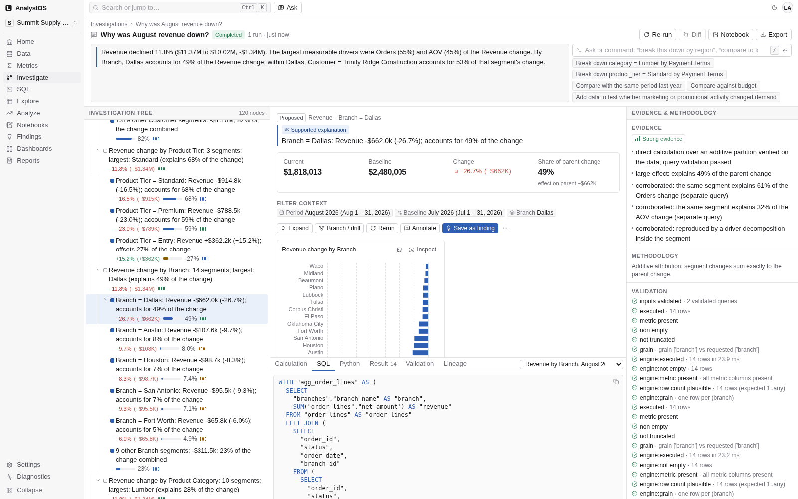
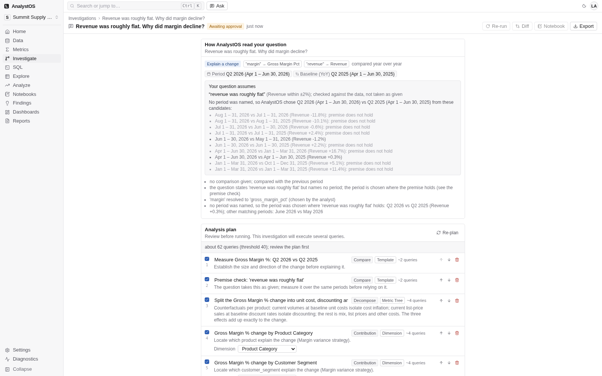
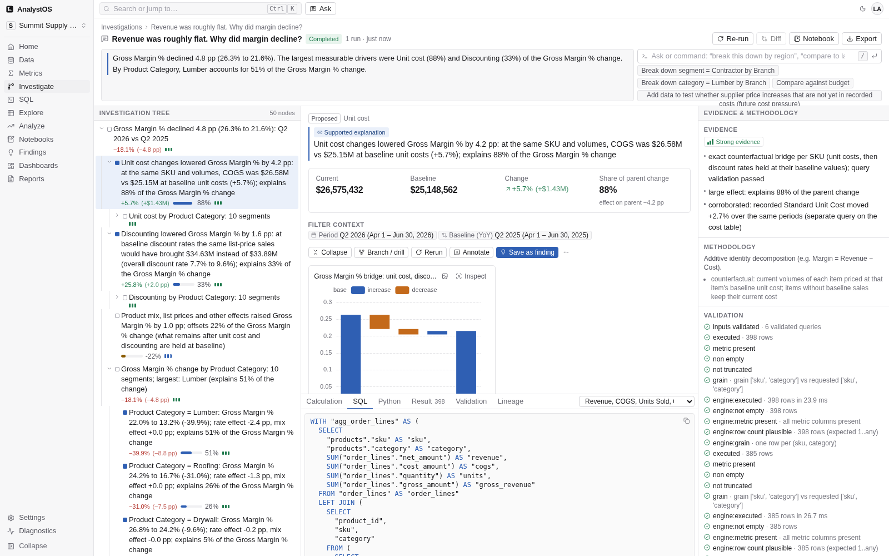
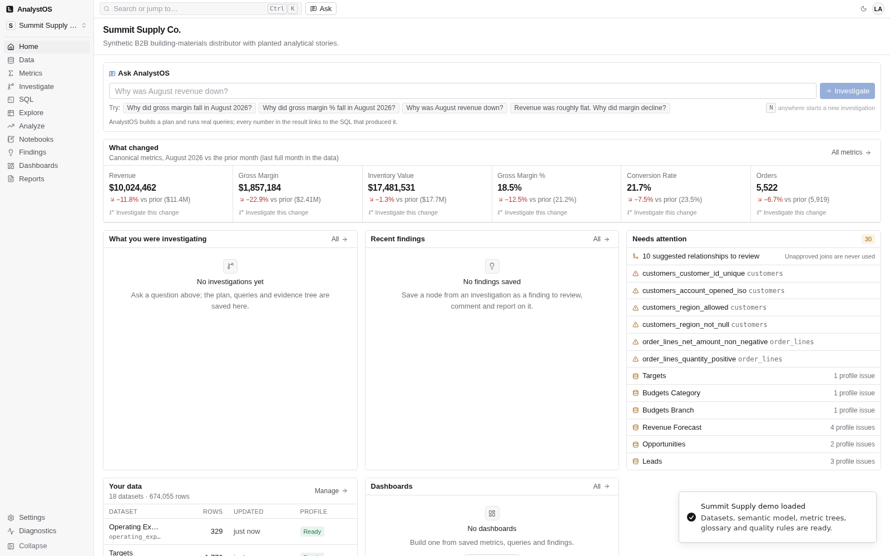
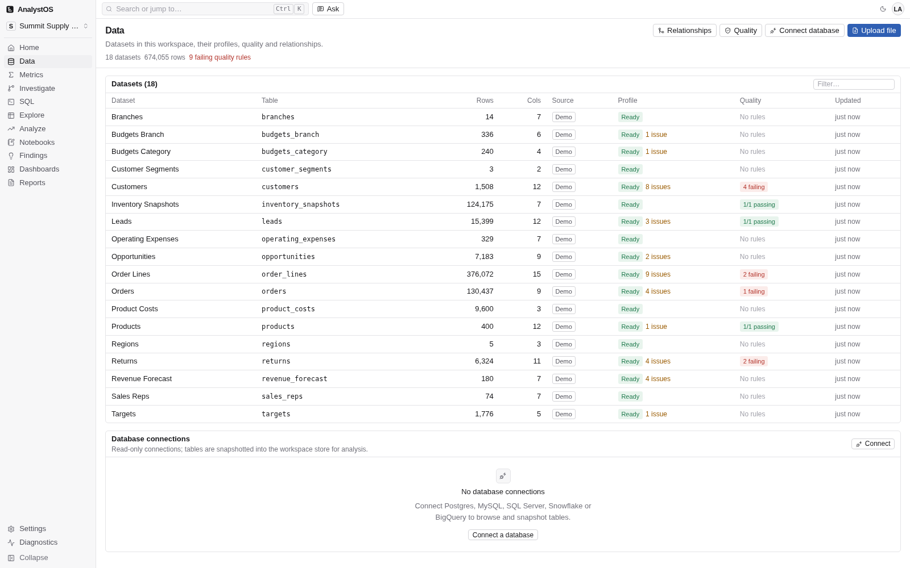
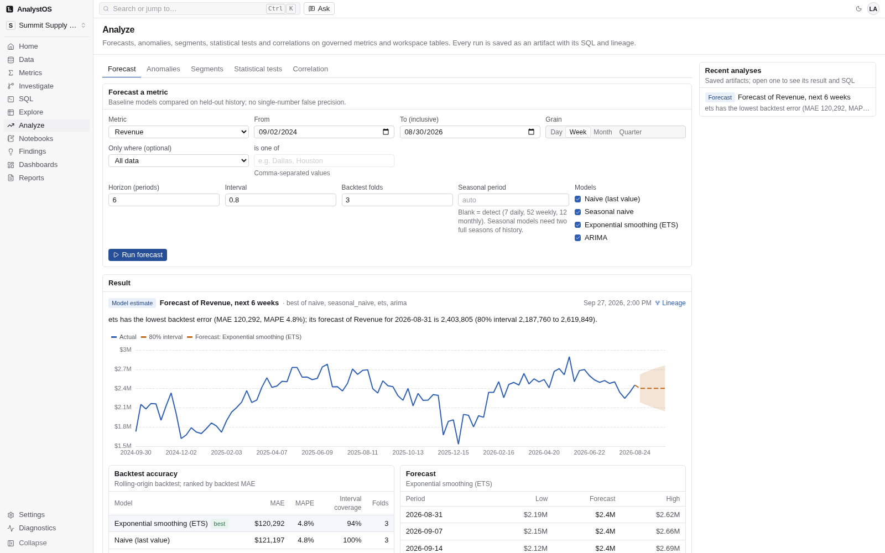
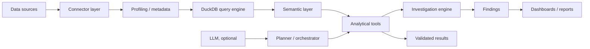

# AnalystOS



**An analytical investigation workspace for BI, data, operations and finance teams.**
You connect your data, define what your metrics mean, and ask questions like *"Why did revenue
fall?"* AnalystOS turns the question into a reviewable investigation plan, runs it as real SQL
against your data, decomposes the change with exact arithmetic, and returns a tree of findings
where every number links back to the query that produced it.

The idea in one line: **make the analyst's method executable.**

It runs locally on your machine with a generated demo dataset, needs no cloud service, and works
end to end with no AI API key; see [Quick start](#quick-start).

> **Status:** experimental personal project, built largely with AI assistance and not
> security-audited. Run it locally; see [SECURITY.md](SECURITY.md) before exposing it to a network
> or pointing it at sensitive data.

## The problem

Traditional BI is good at showing *what* happened. Answering *why* is still manual work, and
most of that work is not insight. It is mechanics:

- deciding which **governed** metric the question actually refers to: one approved, versioned
  definition rather than an ad-hoc formula ("margin": which of the four?);
- establishing the right comparison period and checking the baseline is a fair one;
- writing several queries, and getting the joins and the grain right so nothing is double counted;
- testing each dimension that could plausibly break the metric down;
- computing each segment's contribution and confirming the parts reconcile to the whole;
- separating what the data actually shows from what is a plausible but untested idea;
- recording the SQL, filters and metric versions so the conclusion can be defended and re-run.

That sequence is repeatable. AnalystOS encodes it in software. The analyst still decides which
question matters, whether the model is right, and what to do about the answer, but spends less
of the day assembling the evidence and more of it interpreting the business.

## One investigation, end to end

The demo dataset is a building-materials distributor with two years of orders. Ask:

> **Why was August revenue down?**

AnalystOS resolves *revenue* to the governed **Revenue** metric, notices no comparison was given
and proposes **August 2026 vs July 2026**, reads the Revenue metric tree (which drivers multiply
into Revenue) and the dimensions that can safely break Revenue down, and writes a plan. You see and
edit that plan before anything runs. Then it measures the total change, decomposes the
mathematically related drivers, tests each valid dimension, checks that the claimed contribution
shares reconcile to the total, and ranks what is left. The label on the right of each node below
says what kind of claim it is (a measured *observation*, or a *supported explanation* of the
parent's change) and how strong the evidence behind it is (*strong*, *moderate*, *weak* or
*hypothesis*); *AOV* is average order value.

```
Revenue declined 11.8% ($11.37M to $10.02M): August 2026 vs July 2026   observation, strong
+-- Orders declined 6.7% (5,919 to 5,522): explains 55% of the change     supported explanation
+-- AOV declined 5.5% ($1,920 to $1,815): explains 45% of the change      supported explanation
+-- Branch = Dallas: Revenue -$662.0k (-26.7%), 49% of the change
|   +-- Customer = Trinity Ridge Construction: 53% of the Dallas change
+-- Product Tier = Entry: Revenue +$362.2k (+15.2%), offsets 27% of the change
```

Every number traces back along one chain: **Conclusion -> Evidence -> Calculation -> Query ->
Source data**, and each link is visible in the UI.

Every node carries the SQL that produced it, the filters and time window it used, the exact version
of each metric definition, a validation checklist, and the reasons behind its label, verbatim.
Re-run it next month and AnalystOS re-executes the same stored plan and tells you node by node what
moved, and whether it moved because the data
changed, because a metric definition changed, or not at all.



## How is this different from asking an AI model?

Most "chat with your data" tools have the same shape. A language model decides what to query,
writes the SQL, reads the rows back, and writes the answer. The model is in the middle of every
step, including the arithmetic, and the result is as good as that particular generation.

```
Typical AI analytics
  question -> model picks the data -> model writes SQL -> database -> model reads rows -> answer

AnalystOS
  question -> governed interpretation -> deterministic investigation plan -> governed metric
  definitions -> grain-safe SQL -> executed + validated measurements -> deterministic analytical
  math -> reconciled evidence tree -> answer
```

The whole middle of that second line runs without a language model. AnalystOS runs end to end
with no API key configured, and the analytical eval suite runs that way in CI; the results are
[below](#analytical-correctness-and-testing). An optional model can help read the question and
word the answer, inside bounds described further down; it is never allowed to produce a number.



### What "deterministic" means here, and what it does not

It does **not** mean hard-coded answers, and it is not a lookup table of canned questions.

Natural language is converted into a bounded analytical representation over your governed
metrics, dimensions, relationships, calendars and investigation templates, and that
representation is then executed by deterministic analytical operations. The architecture is a
compiler's: four distinct typed intermediate forms sit between English and SQL, and each one is a
real object you can inspect, persist and edit.

| Stage | Intermediate form | What it holds |
|---|---|---|
| Question → interpretation | `Interpretation` | resolved metric ids, absolute time window and baseline, comparison kind, intent, typed filters, ambiguous terms, stated premises |
| Interpretation → plan | `AnalysisPlan` | ordered steps with a cost estimate and a provenance tag; editable: add, remove, reorder, disable |
| Plan step → metric query | `MetricQuery` | metrics, dimensions, filters and time, independent of any SQL dialect |
| Metric query → SQL | `CompiledQuery` | the SQL and parameters, the resulting grain, warnings, and the exact metric versions used |

The honest caveat, and it is a strength: **the front end is a deterministic matcher over your
governed vocabulary, not a general English parser.** It resolves metric names, synonyms, glossary
terms, dimension values and a large vocabulary of time expressions. A question outside that
vocabulary comes back as ambiguous, or as a planning error that says what it could not resolve;
it is not guessed at. You always know whether the system understood you.

## Why you can trust the answer

Trust here is mechanical, not rhetorical. Six things hold it up.

**1. Every number comes from executed, inspectable SQL.** A node's value is read off a query
result, never composed. Open any node and the **SQL**, **Result**, **Validation**, **Calculation**
and **Lineage** tabs show exactly how it was produced. A query that fails to run, or whose result
fails validation, becomes a *failed* node that says so and contributes no value to the tree. A
check that fires against an otherwise sound result (a driver identity leaving a residual above
tolerance, say) does not hide the node either: it forces the evidence down to *weak* and prints
the failing check as the reason.

Every governed measurement is SQL. A plan can also carry a sandboxed Python step, and its node
stores the code and its output in place of a query, held to the same rule, that a value exists
only because something executed and was recorded.



**2. The joins are grain-safe by construction.** The compiler only uses relationships you have
approved, and it refuses, with an explanation, to group a metric by a dimension reached through
a one-to-many path that would double count. Where the result is still correct but you should know
something (an ambiguous join path, a non-additive average, a semi-join rewrite, an immature
cohort, a declared key that is not actually unique in the data), it warns instead.

**3. The decomposition arithmetic is exact, by choice of method.** Multiplicative driver trees use
LMDI, which sums exactly to the parent change; where a driver is zero or negative the logarithm is
undefined, so the engine either falls back to an exact Shapley decomposition or declines rather
than approximating. Additive trees use the additive identity. Segment attribution uses additive
contribution, ratio mix/rate, or volume/mix/rate, each constructed so the parts sum to the whole.

**4. Reconciliation is enforced, and failure downgrades rather than hides.** If segment values do
not add to the total, shares of change are simply not reported. If a driver identity leaves a
residual above 2% of the parent change, the node is forced to *weak* and the reason is printed. If
the attribution method is not exact, the segment move is still reported as measured, but its share
of the total is not claimed.

**5. Evidence strength is a published rule set, not a score.** There are four categories
(strong, moderate, weak, hypothesis-only), assigned by documented rules (share of parent change,
corroboration by a separate executed test, small-base instability, validation failures), and the
UI shows the reasons verbatim. AnalystOS deliberately produces no numeric confidence score.

Worth separating the two kinds of guarantee. Points 2 to 4 are **exact by construction**: the
identities sum to the parent change as a matter of arithmetic, and the grain rules are structural.
Point 5 is **judgement encoded as rules**: "a share of at least 25% with corroboration is strong",
"a residual above 2% forces weak", "a driver identity that misses the parent by more than 5% is
not used", "flat means within ±2%". Those thresholds are chosen constants, not theorems. They are
consistent, documented and visible on every node, which is the point, but they are conventions,
and a different team might pick different ones.

**6. Runs are reproducible and diffable.** The plan freezes absolute periods at planning time, so
a re-run a month later still measures the same window. A re-run produces a node-by-node diff plus
explicit dataset-version and metric-version changes, and a finding you had confirmed is reset to
*needs review* if its value or share moved materially; a stale confirmation never silently
stands. Reproducibility is over *data + definitions + plan*: change the rows or a definition and
the tree changes, and the diff tells you which of the three moved.

Detail: [docs/analytical-correctness.md](docs/analytical-correctness.md) ·
[docs/investigation-engine.md](docs/investigation-engine.md)

### Where the optional AI is allowed to act

AnalystOS is fully functional with no model configured. When a provider *is* configured (server
setting, workspace setting and an API key must all be present), the model is allowed into eight
bounded places, and the boundary is worth stating precisely rather than as a slogan.

| The model may | What bounds it |
|---|---|
| Suggest which metric an ambiguous word means | Only from the closed candidate list the deterministic matcher produced; anything else is dropped. It is a suggestion; the investigation still reports *needs disambiguation* until a human chooses |
| Propose up to three extra plan steps | Each must name a dimension already proven reachable and fan-out-safe; accepted steps are ordinary steps tagged `origin=llm` and executed by the deterministic executor. **The model adds a question, not an answer** |
| Draft ad-hoc SQL in the SQL editor, with a repair loop | Read-only enforcement runs on every attempt before execution, at most three attempts, and a final failure is surfaced rather than hidden. Governed metric SQL is never model-written |
| Word the narrative and the brief answer | Two gates, both must pass: a numeric verifier, and a check that no untested hypothesis is stated as fact. If either fails, the deterministic template text stands and the rejection is recorded |
| Propose up to four follow-up questions | Each goes through the numeric verifier; failures are rejected with the offending numbers named |
| Run read-only SQL and sandboxed Python in an exploratory tool loop | **Off by default**, enabled only by a workspace owner. Bounded to six tool steps, read-only enforcement, the Python sandbox and 200-row caps. It runs *after* the tree is built, its results are tagged as ungoverned side artifacts, and it cannot modify the tree. Those artifacts can, however, be cited by the model narrative: with the loop on, the brief answer may quote a figure no governed metric query produced |
| Propose findings from that loop | Must cite at least one executed artifact, must pass the numeric verifier against *only* those artifacts, and lands as `needs_review`, never auto-accepted |
| Write report, business-review and executive-summary prose | The same two gates as the narrative (numeric verifier and hypothesis-leak check), and the deterministic summary stands if either fails. The monthly business review must additionally be reviewed block by block before publishing |

What the model categorically cannot do: produce or alter any value, change, share, percentage,
evidence strength, statement type, ranking, node, tree shape, metric definition, join, filter,
period, or the SQL of any governed metric query.

Two mechanisms do the enforcing and are worth naming:

- **The numeric verifier** extracts every numeric claim from model-written prose and rejects any
  claim that cannot be reproduced from the executed artifacts (the governed metric queries, plus
  the tool loop's ungoverned ones when it is enabled) *at the precision it was written with*:
  "11.8%" must round-trip; "11.9%" fails. It also binds claims to their subject, so
  "revenue is up 50%" is rejected when 50 exists somewhere in the artifacts but is not revenue's
  measured change, or has the wrong sign. **A narrative with a single unverifiable number is
  rejected as a whole**, and the deterministic template is used instead.
- **Untrusted-data handling.** System instructions are static strings, never formatted with user
  or data text. The question is its own block. Anything read from your data is JSON-serialised,
  sanitised and wrapped in a delimiter carrying a per-call random nonce, so a crafted cell value
  cannot close the block early and issue instructions. Every model output is schema-validated, then
  held to whichever gate fits it: a closed candidate list, the list of reachable dimensions, a
  read-only parse plus a dry run, or the numeric verifier.

Detail: [docs/ai-architecture.md](docs/ai-architecture.md) · [docs/security.md](docs/security.md)

## What AnalystOS will not claim

AnalystOS answers "why" through **measured attribution over the modelled data**. That is a real
and useful answer, and it is not the same thing as causality.

A decomposition share is an accounting identity: "Dallas accounts for 49% of the measured change"
means Dallas's movement, plus the other branches' movements, sums exactly to the total movement.
It does not establish that anything about Dallas *caused* the decline. Correlation and regression
outputs are labelled exploratory and carry the caveat explicitly. Explanations the data cannot
test (competitor activity, weather, a shift in customer preference) are generated deliberately,
but they are labelled **hypothesis**, phrased conditionally ("Hypothesis (not tested): …"), and
carry a user-facing warning not to report them as fact. Model-written prose that states one of
them plainly is rejected by the hypothesis-leak check.

The vocabulary is narrow on purpose, and worth defining exactly. A **driver** is a component of a
metric identity: Revenue = Orders x AOV, so Orders and AOV are Revenue's drivers, not its causes.
**Explains N%**, which is how the product words a contribution share, means *accounts for N% of the
measured change* and nothing more. Everything the data cannot test is a **hypothesis**.

## A harder question: which metric, and against what baseline?

The demo's second story shows the part of the analyst's method that tools usually skip:

> **Revenue was roughly flat. Why did margin decline?**

"Margin" is ambiguous. The semantic model defines Gross Margin, Gross Margin %, Contribution
Margin and Operating Margin, and the glossary lists all four, so AnalystOS asks rather than
picking one. Then it treats *"revenue was roughly flat"* as a **premise to be checked, not a fact
to be accepted**: it evaluates ten candidate period pairs against the data, strikes out the ones
where revenue was not flat (including August vs July, where revenue fell 11.8%), and selects
**Q2 2026 vs Q2 2025**, where revenue moved +0.3%.



The result splits the 4.77 pp Gross Margin % decline into an exact counterfactual bridge: unit-cost
inflation −4.21 pp (Q2 2026 lines priced at the same product's cost twelve months earlier),
discounting −1.61 pp (Q2 2026 lines at Q2 2025 segment discount rates), with residual mix and other
effects +1.05 pp.



## Why the semantic model matters, and the risk it carries

None of the above is possible against raw database columns. AnalystOS needs governed knowledge:
what Revenue means and what it excludes; how Gross Margin % is defined; which dimensions can
safely break which metric down; which joins are approved; which date column belongs to which
metric; what is additive over time and what is a balance that must be read at a point in time;
and how business drivers relate to each other in a metric tree. That knowledge is what lets the
system analyse deterministically instead of guessing from column names.

Which means the honest risk is this: **a deterministic engine with a wrong semantic model
produces a reproducibly wrong answer, with full lineage.** The arithmetic and the grain are
guaranteed. The business definition is not.

What the product does about it:

- **Model validation.** A referential-integrity and lint pass over the whole model (dangling
  references, unresolvable derived formulas, duplicate names, unknown metric-tree nodes), with
  hard errors distinguished from warnings.
- **Approval as a gate.** Discovered relationships and suggested driver edges are always proposed
  as unapproved. Unapproved joins are never used by the compiler; unapproved driver edges never
  drive a decomposition.
- **The declared model is tested against the rows.** Join analysis measures a relationship's real
  cardinality and warns when the data disagrees with the declaration or when a join would fan out;
  the compiler repeats that check at query time on the actual keys.
- **Per-query validation.** Grain uniqueness, non-null checks, zero denominators and
  filters-actually-applied are checked on every result, not assumed.
- **Versioning.** Each metric definition has an immutable version id derived from a hash of the
  definition. It is recorded on every artifact, so editing a definition shows up in the re-run
  diff as a metric-version change rather than silently changing an answer.
- **Ambiguity is surfaced, not resolved.** When a term matches several metrics, the system asks.

None of that validates that "Revenue" matches what your business means by revenue. It makes the
definition explicit, versioned, visible and consistently applied; the rest is your modelling
work. Detail: [docs/semantic-layer.md](docs/semantic-layer.md)

## What you can do

* **Connect data.** Upload CSV, Excel (multi-sheet, messy headers, with a preview that is exactly
  what gets ingested), Parquet or JSON. Read-only connectors for Postgres, MySQL, SQL Server,
  Snowflake and BigQuery are implemented against their drivers and tested with fakes, since no live
  credentials were available ([docs/connectors.md](docs/connectors.md)).
* **Understand it.** Column profiles, data-quality issues, a Data Quality Center with rules, run
  history and failing rows (AnalystOS never mutates your data), plus relationship suggestions
  with confidence scores that you approve before anything uses them.
* **Model it.** Metrics (simple, ratio, derived) with immutable versions; semi-additive balances
  such as inventory, read as the last value in a period and never summed over time; ratios always
  computed as a ratio of sums, never a sum of ratios; dimensions, metric trees, a glossary and a
  fiscal calendar ([docs/semantic-layer.md](docs/semantic-layer.md)).
* **Investigate.** Ask, review and edit the plan, and get a ranked tree with contribution to the
  parent change, evidence strength with reasons, charts, and the calculation, SQL, validation and
  lineage behind each node. Drill, annotate, confirm or reject nodes; type commands ("break this
  down by region", "compare to last year", "save this as a finding"); re-run on new data and diff,
  with your decisions carried forward ([docs/investigation-engine.md](docs/investigation-engine.md)).
* **Analyze.** Forecasts (naive, seasonal naive, ETS, ARIMA) with prediction intervals and rolling
  backtests; anomaly detection with a sensitivity control and one-click investigation of an
  anomalous day; RFM and growth-by-profitability segments; t-tests, chi-square, proportion tests
  and confidence intervals with their assumptions checked; correlation and regression labelled
  exploratory. Every run is saved as an artifact with its SQL and lineage.
* **Work directly.** SQL editor with schema autocomplete, a no-code Explorer and pivot, and
  notebooks (SQL, sandboxed Python, Markdown, charts, findings).
* **Share.** Findings with a review workflow and lineage; dashboards bound to semantic metrics
  with KPI-to-source lineage; reports and a monthly business review that must be reviewed block by
  block before publishing; exports (CSV, Excel, Markdown, HTML, PDF with chart images, notebook).
* **Collaborate securely.** Password accounts, workspace roles and single-use invite links, plus a
  no-password single-user mode for a personal machine that refuses requests from other machines
  ([docs/security.md](docs/security.md)).
* **Automate.** A typed REST API with OpenAPI docs ([apps/api/API.md](apps/api/API.md)) and an MCP
  server for external agents ([docs/mcp.md](docs/mcp.md)).







Screenshots are regenerated with `node tests/e2e/scripts/screenshots.mjs <web url>` against a
freshly started stack. The title card at the top is rendered from `docs/src/title-card.html` with
`node docs/src/render-title-card.mjs`.

## How an investigation runs

The pipeline, in order. The optional AI assist points are marked *(assist)*; everything else is
deterministic. Steps 3 and 7 to 9 are the mechanics behind trust points 2 to 5 above and are named
here rather than explained again.

1. **Interpret** *(assist: suggest what an ambiguous word means)*: match the question against the
   governed vocabulary: metrics, synonyms, glossary terms, dimension values, time expressions.
   Resolve the window and baseline to absolute dates. Extract stated premises and classify intent.
2. **Plan** *(assist: up to three extra steps)*: derive steps from the metric tree, the dimensions
   proven reachable without fan-out, a premise check for each premise the question takes as given,
   and the investigation template's checks. Estimate query cost; above the approval threshold
   (40 queries) the plan must be reviewed before it runs.
3. **Compile**: each step becomes a metric query, then grain-safe SQL, recording the metric
   versions used.
4. **Execute**: run read-only against the workspace store, under a query budget, row limit and
   timeout.
5. **Validate**: executed, metric present, non-empty, plausible row count, non-null value,
   non-zero denominator, not truncated, grain as requested, filters actually applied.
6. **Record**: every query becomes an artifact holding its SQL, parameters, filters, window,
   metric versions, dataset versions, a result snapshot, its validation summary and any warnings,
   keyed by a content-stable id.
7. **Decompose and attribute**: exact driver identities; segments by additive contribution, ratio
   mix/rate or volume/mix/rate.
8. **Reconcile**: the parts must sum to the whole, or shares are withheld and evidence downgraded.
9. **Assess and rank**: evidence strength and statement type by the published rules, corroborated
   across separate tests, then the tree is ranked.
10. **Answer, re-run, diff** *(assist: follow-up questions and the narrative)*: the brief answer is
    the deterministic template, or, with AI configured, a model narrative that passed both the
    numeric verifier and the hypothesis-leak check. Re-run the stored plan on demand and diff node
    by node, including dataset and metric-version changes.

The fourth assist point sits outside the ten: when a workspace owner enables the exploratory tool
loop, it runs on the finished tree, after step 9. See
[Where the optional AI is allowed to act](#where-the-optional-ai-is-allowed-to-act).

## Architecture



| Path | What |
|---|---|
| `packages/engine` | `analystos_engine`: DuckDB store, ingest, connectors, profiling, quality, relationships, semantic model and compiler, SQL safety, calendar, analysis, Python sandbox |
| `packages/investigator` | `analystos_investigator`: interpretation, planning, execution, evidence, drill/rerun/diff, commands, summaries, optional LLM orchestration |
| `apps/api` | `analystos_api`: FastAPI, SQLAlchemy + Alembic, auth, jobs, persistence, exports, audit |
| `apps/mcp` | `analystos_mcp`: MCP server |
| `apps/web` | Next.js 15 workstation UI |
| `packages/demo-data` | `analystos_demo`: Summit Supply Co. demo data, answer key and semantic model |
| `tests/evals`, `tests/e2e` | Analytical evals and the Playwright acceptance flows |
| `docs/` | Documentation (below) |

More: [docs/architecture.md](docs/architecture.md) · [docs/decisions.md](docs/decisions.md)

## Quick start

Requirements: Python 3.12+, [uv](https://docs.astral.sh/uv/), Node 24 and pnpm. No Docker,
database server or API key needed.

```bash
make setup      # uv sync (all packages, all extras) + pnpm install for the web app
make demo       # generate and verify the dataset (~12 s first run, ~1 s after), print its stories
make dev        # API on http://localhost:8000 (docs at /api/docs) + web on http://localhost:3000
```

Open http://localhost:3000 and click **Load Summit Supply demo**. On your own machine the first
visit signs you in as the local analyst (single-user mode until you create an account); requests
from other machines are refused in that mode and must sign in.

### With Docker

```bash
make docker-up  # writes .env (secret key, proxy secret, first-account setup token) if missing, then docker compose up --build
```

This starts Postgres (metadata), the API (`apps/api/Dockerfile`) and the web app
(`apps/web/Dockerfile`), **bound to 127.0.0.1 by default** (`AOS_PUBLISH_HOST`), with password
sign-in required. Create the
first account at http://localhost:3000 using the setup token printed by `make docker-env` (also in
`.env` as `AOS_BOOTSTRAP_TOKEN`); invite everyone else from Settings > Members. Serving other
machines needs a TLS reverse proxy; see the deployment model in
[docs/security.md](docs/security.md). Configuration is documented in
[`.env.example`](.env.example).

## Demo walkthrough

The Summit Supply Co. dataset is a Texas and Oklahoma building-materials distributor: 18 tables,
two years of orders, deliberately messy files and five planted stories
([docs/demo-scenarios.md](docs/demo-scenarios.md)).

1. **Load the demo** from the welcome screen or the command palette (Ctrl/Cmd+K, "Load Summit
   Supply demo").
2. **Data.** Open `customers` to see the profile flag duplicate IDs, null regions and malformed
   dates; open the Data Quality Center to see which rules fail and inspect the failing rows.
3. **Relationships.** Review the suggested joins and their confidence. `returns.order_id` only
   matches after trimming whitespace, so that join is left unapproved, and therefore unused.
4. **Metrics.** Revenue excludes cancelled orders by definition; Gross Margin, Gross Margin %,
   Contribution Margin and Operating Margin all exist; open the revenue tree (Orders × AOV;
   Orders = Customers × Frequency; AOV = Units per Order × ASP).
5. **Investigate "Why was August revenue down?"** This is the walkthrough that carries the argument.
   Review the plan, run it, read the tree. Click "Branch = Dallas" for its chart, filter chips and
   evidence, then the **Calculation** and **SQL** tabs in the inspector. **Re-run** reproduces
   every node and the diff is empty. **Branch / drill** by Customer to find Trinity Ridge
   Construction, then **Save as finding**.
6. **Report it.** Type *build me a report* in the command bar, or open Reports → Business review
   for August 2026. Mark each block reviewed (or exclude it) and publish; export HTML or PDF with
   the charts.
7. **Ask the hard one: "Revenue was roughly flat. Why did margin decline?"** AnalystOS asks
   which margin you mean, checks the premise against the data, picks Q2 2026 vs Q2 2025 (August vs
   July is rejected because revenue fell 11.8% there), and splits the 4.77 pp decline into unit cost
   (−4.21 pp, mostly Lumber and Roofing) and discounting (−1.61 pp).
8. **Analyze.** Forecast revenue with backtests, scan daily revenue for anomalies and investigate
   one, or segment customers.
9. **Try the other stories.** "Why did conversion rate decline in Q2 2026?", "Why did inventory
   value increase in June 2026 compared with June 2025?", "Why was Q2 2026 revenue below forecast?"

## Analytical correctness and testing

```bash
make test        # all Python suites (one process per suite) + web unit tests
make evals       # analytical evals with the scorecard printed
make setup-e2e   # once: Playwright + Chromium
make e2e         # acceptance flows 1 and 2 in a browser (boots API + web on ports 18765 / 13765)
```

`make evals` completes in about 70 seconds with **no network, no Docker and no API key** and
prints a per-question scorecard. The current result:

```
Evidence surfaced: 67/67 (100%); required: 67/67; questions passing: 16/16
```

Those are two different units: **67 evidence expectations across 16 benchmark questions**. Every
expectation is required; none is marked optional. The suite has three parts:

- **Compiler output versus hand-written ground-truth SQL**: 17 parametrised comparisons that
  execute the compiler's SQL and an independently hand-written query over the raw files in a
  separate DuckDB connection and require the same answer, plus standalone guards that every metric
  compiles, that a grain violation is refused, that an unapproved relationship is never used, and
  that mutating SQL never reaches the store. This is the strongest part of the suite: the semantic
  layer checked against an independent expression of the same question.
- **Benchmark questions against the demo's answer key**: 16 questions covering headline values,
  top drivers, segments, period selection, premise verdicts and ambiguity handling, plus three
  kinds of negative check that matter as much as the positive ones: no share is claimed over
  overlapping segments (`no_overlap_shares`), every evidence node reaches executed SQL through its
  lineage (`traceable`), and a circular identity is never offered as a driver (`no_driver`: Gross
  Margin is not "explained" by Gross Margin). Also asserted: re-running an investigation reproduces
  it exactly.
- **Acceptance flows 1 and 2 through the REST API**: four tests driven in-process, one of them
  asserting that a re-run keeps the analyst's confirm and reject decisions.

**What this does and does not prove.** The answer key is computed, not hand-typed: a module
re-measures the planted stories from the generated files with DuckDB. But that module is a sibling
of the one that plants the stories, with one genuinely independent cross-check: the demo-data
story tests re-derive the headline numbers with their own hand-written SQL. So the benchmark
proves that on a dataset with known planted changes the deterministic engine recovers those changes
(the right segments, the right magnitudes, the right period and the right premise verdict) and
traces every node to executed SQL, reproducibly and without a language model. It does **not**
prove accuracy on unseen data. How well this generalises to real business data depends on the
quality and completeness of the semantic model, and validating that is the important next step.

The wider suite:

- **Python** (`scripts/test-python.sh`): engine, investigator, demo data, API, MCP and evals, each
  in its own pytest process. No network, Docker or API key.
- **Web** (`apps/web`): Vitest component and logic tests (two workers by default; set
  `VITEST_MAX_WORKERS` for more).
- **E2E** (`tests/e2e`): Playwright drives flow 1 (including a re-run with an empty diff) and flow
  2 (the margin question) end to end with real, actionability-checked clicks.
- **CI** ([.github/workflows/ci.yml](.github/workflows/ci.yml)): ruff lint and format check, mypy
  over all five Python packages (configured in `pyproject.toml` under `[tool.mypy]`), every Python
  suite including the evals, Alembic upgrade/downgrade/check on SQLite and Postgres plus an API boot against Postgres, web lint,
  typecheck, tests and production build, then the Playwright flows against that production build,
  all with job and step timeouts.

Full detail: [docs/analytical-correctness.md](docs/analytical-correctness.md)

## Known limitations

* **External databases**: the Postgres, MySQL, SQL Server, Snowflake and BigQuery connectors are
  implemented against their drivers but were tested only with fakes and mocks; the drivers are
  optional extras (`uv sync --all-packages --all-extras`).
* **A wrong semantic model gives a reproducibly wrong answer, with full lineage.** The arithmetic,
  the grain and the traceability are guaranteed; the business definition is not. See *Why the
  semantic model matters* for the mitigations, and [docs/semantic-layer.md](docs/semantic-layer.md).
* **The analytical evals cover only the demo's planted stories** (67/67 expectations across 16
  questions); on your data, investigation quality tracks your semantic model's metric trees and
  dimensions. See *What this does and does not prove* above.
* **AI is optional and Anthropic-only today.** It never produces numbers, and its wording is
  discarded whenever the verifier cannot match every number to an executed result.
* **The exploratory AI tool loop is a separate, owner-gated opt-in, off by default.** It is the one
  AI surface that executes code, and the one whose ungoverned results a model narrative may quote.
  See *Where the optional AI is allowed to act* for its bounds.
* **PDF export** needs WeasyPrint and Pango (installed in the API Docker image). Without them the
  PDF menu item opens the browser's print dialog on the HTML export instead (Save as PDF).
* **Forecast backtests** for seasonal models need two full seasons of history; on the two-year
  demo the seasonal models are not backtested at monthly or weekly grain (the backtest table says
  why), while the non-seasonal models are.
* **The Python sandbox** is defence in depth on one host (namespaces, Landlock, rlimits, an audit
  hook), not a virtual machine; run the API in a container for multi-tenant use.
* **Scale**: one API process with an in-process job pool and one DuckDB file per workspace; no
  horizontal scaling and no scheduled investigations.
* **Security**: no SSO; rate limiting covers sign-in, failed sign-ups and invite tokens only; set
  CSP and HSTS at your reverse proxy. Not independently audited; see [SECURITY.md](SECURITY.md).
* **Node and pnpm versions are pinned in CI only** (Node 24, pnpm 12.4.1). There is no `engines`
  field, `packageManager` field or `.nvmrc`, so a local toolchain mismatch gives no warning.

## Development

```bash
make help        # every task
make api         # API only (uv run analystos-api)
make web         # web only
make migrate     # apply Alembic migrations to DATABASE_URL
make lint        # ruff check + ruff format --check + eslint
make typecheck   # mypy over all five Python packages + tsc --noEmit
make typecheck-all  # the same mypy run, without the TypeScript half
make build       # production web build
make format      # ruff autofix + format
```

Configuration is read from the environment or `.env` (see [`.env.example`](.env.example)). The
metadata database defaults to SQLite in `./data`; set `DATABASE_URL=postgresql+psycopg://...` for
Postgres. Workspace data lives under `DATA_DIR/workspaces/{id}/warehouse.duckdb`.

## Documentation

* [Architecture](docs/architecture.md): components, runtime topology, the request path
* [Semantic layer](docs/semantic-layer.md): objects, ambiguity, grain-safe compilation, joins
* [Investigation engine](docs/investigation-engine.md): lifecycle, planning, attribution, evidence
* [AI architecture](docs/ai-architecture.md): where the LLM is used, staged orchestration, tools, prompt injection
* [Analytical correctness](docs/analytical-correctness.md): guarantees, the eval suites, the latest scorecard
* [Connectors and ingestion](docs/connectors.md): files, databases, testing without credentials
* [Security](docs/security.md): deployment model, auth, read-only access, sandbox, known gaps
* [MCP server](docs/mcp.md): tools, running it, permissions
* [Demo data and scenarios](docs/demo-scenarios.md): the dataset and all five planted stories
* [Architecture decisions](docs/decisions.md): the ADRs behind the design
* REST API reference: [apps/api/API.md](apps/api/API.md) and `/api/docs` on a running server

## License

[MIT](LICENSE).
