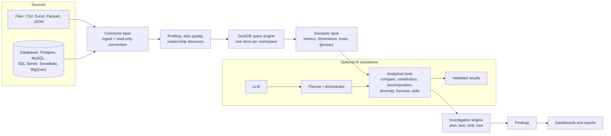

# Architecture

AnalystOS is a monorepo with five parts and one rule: **the analytical engine sits between the data
and the truth, never the LLM.** Every number shown to a user comes from a query the engine executed and
recorded as an artifact.



```
Data Sources -> Connector Layer -> Profiling/Metadata -> DuckDB/Query Engine -> Semantic Layer
            -> Analytical Tools -> Investigation Engine -> Findings -> Dashboards/Reports

LLM -> Planner/Orchestrator -> Analytical Tools -> Validated Results
        (the LLM proposes; tools execute; only tool results carry numbers)
```

## Components

| Path | Package | Owns |
|---|---|---|
| `packages/engine` | `analystos_engine` | DuckDB workspace store, file ingest, connectors, profiling, data quality, relationship discovery, semantic model and grain-safe compiler, SQL safety, calendar, validation, analysis (compare, contribution, decomposition, anomaly, forecast, stats, segmentation, correlation), Python sandbox. Pure library, no web framework. |
| `packages/investigator` | `analystos_investigator` | Question interpretation, planning, hypotheses, execution into an investigation tree with evidence strength, drill, rerun and diff, commands, executive summaries, optional LLM orchestration. Depends only on the engine. |
| `apps/api` | `analystos_api` | FastAPI REST API (`/api/v1`), SQLAlchemy metadata DB with Alembic migrations, auth, workspaces, jobs, persistence of semantic versions, investigations, findings, dashboards, reports, exports, audit and diagnostics. |
| `apps/mcp` | `analystos_mcp` | MCP server for external agents (see [mcp.md](mcp.md)). |
| `apps/web` | Next.js 15 app | The analyst workstation UI (TypeScript, Tailwind v4, Radix-based components, ECharts, CodeMirror 6, TanStack Query/Table). |
| `packages/demo-data` | `analystos_demo` | Summit Supply Co. generator, answer key, demo semantic model, DQ rules and loader. |
| `tests/evals`, `tests/e2e` | | Analytical evals and the Playwright acceptance flow. |

## Runtime topology

* **Metadata database**: SQLite by default (`sqlite:///./data/analystos.db`), Postgres in
  docker-compose. 38 tables: users, sessions, API tokens, workspaces and memberships, datasets and
  versions, relationships, quality rules and runs, semantic objects with immutable metric versions and
  content-addressed semantic snapshots, queries, notebooks, investigations and runs, artifacts,
  findings (versions, comments), dashboards, reports, stored files, jobs, audit log, diagnostic
  events, AI usage. Migrations run at startup (`AOS_AUTO_MIGRATE=true`) or with
  `uv run analystos-api-migrate`.
* **Analytical store**: one DuckDB file per workspace at
  `${DATA_DIR}/workspaces/{workspace_id}/warehouse.duckdb`, opened with external access disabled and
  configuration locked. Uploaded files and demo data are ingested into it; external databases are
  queried live (read-only) or snapshotted into it.
* **API** on port 8000 (OpenAPI at `/api/docs`). **Web** on port 3000, served by `apps/web/server.mjs`
  (Next.js behind a thin Node server that records each browser's socket address); the route handler
  `app/api/[...path]/route.ts` proxies `/api/*` to `API_URL` and tells the API who the real client is
  (see the deployment model in [security.md](security.md)).
* **Background work**: an in-process thread pool backed by a `jobs` table (`AOS_JOB_EXECUTION=inline`
  runs jobs synchronously in tests). No message broker.
* **Python sandbox**: a subprocess per run, isolated with user and network namespaces, Landlock,
  rlimits, an audit hook and an import allowlist (details in [security.md](security.md)).

## Request path for a question

1. The web app posts the question to `POST /workspaces/{ws}/investigations`.
2. The API loads the workspace's current semantic model and calls the investigator.
3. The investigator interprets the question deterministically against the model (metrics, synonyms,
   glossary, calendar). An ambiguous term stops here and asks the analyst to choose.
4. It builds a plan from the metric tree, the metric's reachable dimensions and a template. Plans
   estimated above 40 queries wait for approval.
5. Each step compiles a `MetricQuery` through the engine's semantic compiler, runs it read-only on the
   workspace store, validates the result and records an artifact (SQL, parameters, filters, metric
   versions, dataset versions, result snapshot, chart spec, lineage parents).
6. Attribution arithmetic builds the tree; evidence-strength rules label each node; the API persists
   the run with the metric versions and dataset versions it used, so it can be rerun and diffed.

## Reproducibility

Investigations store absolute windows, filters, plan and configuration, the metric `version_id` of
every metric used (`{id}@v{n}:{hash}`), and the content hash and row count of every table read.
Rerunning replays the plan on current data and returns a node-by-node diff plus which datasets and
metric definitions changed.

See also: [semantic-layer.md](semantic-layer.md), [investigation-engine.md](investigation-engine.md),
[ai-architecture.md](ai-architecture.md), [analytical-correctness.md](analytical-correctness.md).
